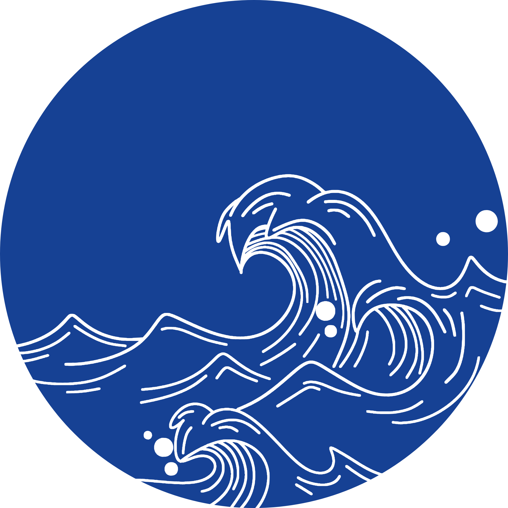

# Oceanthrixa Website

> **⚠️ Notice:** All code in this project was generated by artificial intelligence (AI) according to the professor's requirements.

---

## 📋 Overview

This is a professional static website for **Oceanthrixa**, a company specializing in waterproof electronics and subsea solutions. The website is built with clean, semantic HTML, and responsive CSS, designed to be deployed on Vercel.

The site features three main pages:
- **Home** (`index.html`) - Company introduction and key benefits
- **About** (`about.html`) - Company story, mission, vision, and values
- **Contact** (`contact.html`) - Contact form and direct communication channels

---

## 📁 Project Structure

```
Exercicio Site Git Vercel/
├── index.html          # Home page
├── about.html          # About page
├── contact.html        # Contact page
├── CSS/
│   └── style.CSS       # Main stylesheet
├── img/
│   ├── OceanthrixaLogomarca.png     # Logo symbol
│   └── Oceanthrixa%20Nome.png       # Company wordmark
└── README.md           # This file
```

---

## 🏗️ HTML Structure

### Common Elements (All Pages)

Each HTML file follows the same structural pattern:

#### 1. **DOCTYPE & Metadata**
```html
<!doctype html>
<html lang="en">
<head>
  <meta charset="utf-8" />
  <meta name="viewport" content="width=device-width,initial-scale=1" />
  <title>Page Title</title>
  <link rel="stylesheet" href="CSS/style.CSS" />
</head>
```
- Declares valid HTML5 document
- Specifies UTF-8 character encoding
- Enables responsive design with viewport meta tag
- Links the shared CSS stylesheet

#### 2. **Header (Navigation)**
```html
<header class="site-header">
  <div class="container header-inner">
    <!-- Logo/Brand -->
    <a href="index.html" class="brand">
      
      
    </a>
    
    <!-- Navigation Menu -->
    <nav aria-label="Main menu">
      <ul class="nav">
        <li><a href="index.html" class="active">Home</a></li>
        <li><a href="about.html">About</a></li>
        <li><a href="contact.html">Contact</a></li>
      </ul>
    </nav>
  </div>
</header>
```
- Responsive flexbox layout
- Brand logo linking to homepage
- Active page indicator using `aria-current="page"`
- Semantic navigation with proper ARIA labels

#### 3. **Main Content**
- Wrapped in semantic `<main>` tag
- Centered container with max-width of 1000px
- Page-specific sections and content

#### 4. **Footer**
```html
<footer class="site-footer">
  <div class="footer-inner">
    <div class="footer-brand">
      <!-- Logo images -->
    </div>
    <p>© <span id="year"></span> Oceanthrixa — Subsea Technologies</p>
    <p>Contact: <a href="mailto:...">email</a> • <a href="tel:...">phone</a></p>
  </div>
</footer>

<script>
  document.getElementById('year').textContent = new Date().getFullYear();
</script>
```
- Displays current year dynamically using JavaScript
- Contact links with `mailto:` and `tel:` protocols

---

## 📄 Page-Specific Content

### **index.html** (Home Page)

**Hero Section:**
- Large headline: "Waterproof electronics & subsea solutions"
- Compelling description of services
- Call-to-action button linking to contact form

**Benefits Section:**
- Three-column card layout showcasing key advantages:
  - Certified ruggedness (IP68-rated components)
  - Easy integration (Standard APIs)
  - Technical support (Specialized team)

### **about.html** (About Page)

**About Hero:**
- Company origin story
- Core philosophy about reliability and integration

**Mission, Vision & Values Section:**
- Three-card grid layout
- **Mission:** Deliver subsea electronic solutions
- **Vision:** Become a regional technology reference
- **Values:** Reliability, Transparency, Innovation, Sustainability (listed as unordered list)

### **contact.html** (Contact Page)

**Contact Form:**
- Three input fields: Name, Email, Message
- Textarea for user message
- Submit button
- Client-side form validation using HTML5 `required` attribute
- Currently has `action="#"` (ready for backend integration)

**Contact Links:**
- Email address: `contact@oceanthrixa.com`
- Phone: `+55 (71) 99999-0000`
- LinkedIn company profile link

---

## 🎨 CSS Styling (style.CSS)

### **Reset & Defaults**
```css
* { box-sizing: border-box; margin: 0; padding: 0; }
html, body { 
  height: 100%;
  font-family: Inter, system-ui, -apple-system, "Segoe UI", Roboto;
  color: #0b2540;
  background: #f6fbff;
}
```
- Removes default margins/padding
- Sets consistent typography
- Uses system fonts for optimal performance
- Light blue background color (#f6fbff)

### **Color Scheme**
- **Primary dark**: `#0b2540` (navy blue)
- **Primary accent**: `#0284a2` (teal)
- **Gradient header**: Linear gradient from `#0b5f7a` to `#0b4660`
- **Background**: `#f6fbff` (light blue)
- **Text**: Various shades of teal and navy for readability

### **Header Styling**
```css
.site-header {
  background: linear-gradient(90deg, #0b5f7a, #0b4660);
  color: #fff;
}
.header-inner {
  display: flex;
  align-items: center;
  justify-content: space-between;
}
```
- Gradient background (blue shades)
- Flexbox layout for logo and navigation alignment

### **Logo/Brand**
- Large logo (120px on desktop) scaled responsively
- Wordmark (64px height) positioned next to logo
- All images use `object-fit: contain` for proper scaling
- Smaller versions for footer (80px/36px)

### **Navigation Menu**
```css
.nav {
  display: flex;
  gap: 14px;
  align-items: center;
}
.nav a {
  color: rgba(255, 255, 255, 0.95);
  transition: background .18s, transform .12s;
}
.nav a:hover { 
  background: rgba(255, 255, 255, 0.08);
  transform: translateY(-2px);
}
.nav a.active {
  box-shadow: inset 0 -3px 0 rgba(255, 255, 255, 0.12);
}
```
- Horizontal flexbox layout with equal spacing
- Smooth hover effects with subtle elevation
- Underline indicator for active page

### **Hero Section**
```css
.hero h1 {
  font-size: 1.9rem;
  line-height: 1.15;
  color: #032033;
}
```
- Large, readable headlines
- Proper line spacing for readability
- Dark color for high contrast

### **Buttons**
```css
.btn.primary {
  background: linear-gradient(180deg, #0284a2, #026a8a);
  color: #fff;
  padding: 10px 18px;
  border-radius: 10px;
  box-shadow: 0 8px 20px rgba(2, 104, 138, 0.18);
}
.btn:hover {
  transform: translateY(-3px);
}
```
- Gradient background (teal shades)
- Rounded corners (10px radius)
- Shadow for depth
- Micro-interaction on hover (elevation)

### **Card Components**
```css
.card, .mvz-card {
  background: #fff;
  border-radius: 14px;
  padding: 18px;
  box-shadow: 0 6px 18px rgba(6, 35, 58, 0.06);
  border: 1px solid rgba(6, 35, 58, 0.04);
}
.cards {
  display: grid;
  grid-template-columns: repeat(3, 1fr);
  gap: 18px;
}
```
- White background with subtle shadow
- 3-column CSS Grid layout (desktop)
- Subtle border for definition
- Equal gap between cards

### **Contact Form**
```css
.contact-form {
  display: flex;
  flex-direction: column;
  gap: 10px;
  max-width: 640px;
}
.contact-form input,
.contact-form textarea {
  padding: 10px 12px;
  border-radius: 8px;
  border: 1px solid rgba(2, 36, 50, 0.08);
  background: #fff;
  outline: none;
}
.contact-form input:focus,
.contact-form textarea:focus {
  box-shadow: 0 6px 18px rgba(2, 104, 138, 0.08);
  border-color: #0389a4;
}
```
- Vertical stacking with flexbox
- Consistent input styling
- Focus state highlighting with box-shadow and color change
- Max-width prevents form from becoming too wide

### **Footer**
```css
.site-footer {
  margin-top: 36px;
  padding: 18px 0;
}
.footer-inner {
  display: flex;
  flex-direction: column;
  gap: 8px;
}
```
- Flexible column layout
- Proper spacing from main content
- Minimal padding

---

## 📱 Responsive Design

The CSS includes three breakpoints for mobile-first responsiveness:

### **Tablet (max-width: 1200px)**
- Logo scaled: 120px → 100px
- Wordmark: 64px → 56px

### **Medium Devices (max-width: 900px)**
- Card grid: 3 columns → 2 columns
- Logo further reduced: 88px
- Wordmark: 48px

### **Mobile (max-width: 700px)**
- Header layout changes to column (vertical stack)
- Navigation wraps to multiple lines
- Card grid: 2 columns → 1 column (full width)
- Logo small: 64px
- Logo wordmark: 36px
- Tighter padding (14-16px instead of 20px)
- Headline reduced: 1.9rem → 1.5rem

---

## ♿ Accessibility Features

1. **Semantic HTML**: Uses `<header>`, `<main>`, `<nav>`, `<footer>`, `<article>` elements
2. **ARIA Labels**: Navigation menu has `aria-label="Main menu"`
3. **Current Page Indicator**: Active links use `aria-current="page"`
4. **Alt Text**: All images have descriptive alt attributes
5. **Form Labels**: Each form input has associated `<label>` with `for` attribute
6. **Visually Hidden Text**: `.visually-hidden` class for screen reader text
7. **Focus States**: Form inputs have visible focus indicators with box-shadow
8. **Color Contrast**: Text colors meet WCAG contrast requirements

---

## 🔧 Technical Details

### **JavaScript Usage**
- Minimal JavaScript: Only used for dynamic year display in footer
- Non-intrusive: No event listeners or complex logic
- Improves UX by showing current copyright year

### **Image Handling**
- URL-encoded spaces in filenames (`Oceanthrixa%20Nome.png`)
- Uses `object-fit: contain` for flexible scaling
- Separate versions for header and footer

### **Performance Optimizations**
- Single CSS file (no additional HTTP requests)
- Minimal external dependencies (only system fonts)
- CSS smoothing for better rendering:
  ```css
  -webkit-font-smoothing: antialiased;
  -moz-osx-font-smoothing: grayscale;
  ```

---

## 🚀 Deployment on Vercel

To deploy this website on Vercel:

1. **Push to GitHub**
   ```bash
   git init
   git add .
   git commit -m "Initial commit"
   git push origin main
   ```

2. **Connect to Vercel**
   - Go to [vercel.com](https://vercel.com)
   - Import your Git repository
   - Default settings are perfect (detects static files automatically)

3. **Automatic Deployments**
   - Each push to main branch triggers automatic deployment
   - Preview deployments for pull requests

---

## 📝 Notes

- The contact form's `action="#"` should be updated to point to a backend service or email API for form submission
- Images are referenced but should be placed in the `img/` folder before deployment
- All pages are static and can be hosted on any web server

---

## 📧 Contact Information

- **Email**: contact@oceanthrixa.com
- **Phone**: +55 (71) 99999-0000
- **LinkedIn**: [LinkedIn Profile](https://www.linkedin.com)

---

**Last Updated**: March 2, 2026
